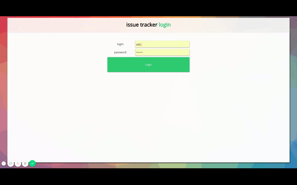
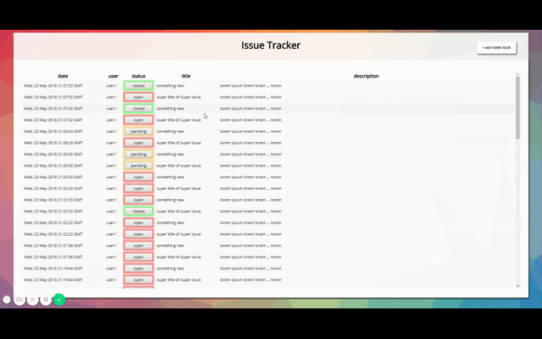
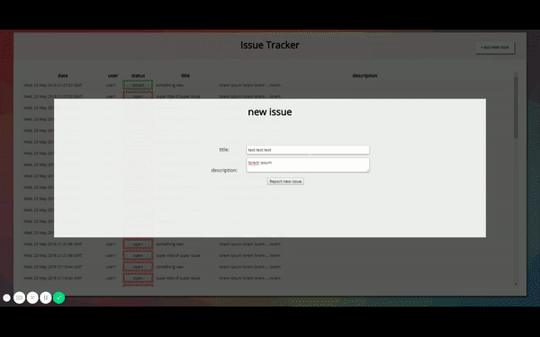
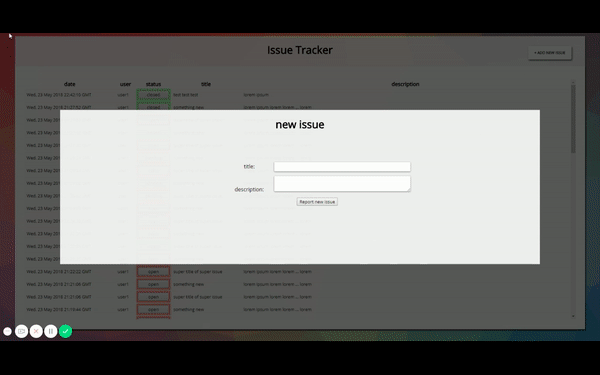

Issue tracker
========
## live demo: [https://issuetrackermjl.herokuapp.com/](https://issuetrackermjl.herokuapp.com/)
#### users:
##### user1, user2, user3, user4
#### password:
##### password

##### add new issue

##### status open -> pending -> closed

##### /new as popup and static 

* typescript
* express
* passport
* next.js
* SSR
* react
* mongodb

#run
--------
- run mongodb 
- yarn dev 

#env
--------
MONGODB_URI (default: __mongodb://localhost:27017/issuetracker__ )
PORT (default: __9000__)

#tests
--------

- __yarn test__ 
will run unit tests for components  (pages/*.test.tsx components/*.test.tsx)
- __yarn testrest__
will test API (index.test.ts) - *you need to run yarn dev first*

#todo:
--------

- pagination
- some filters ?
